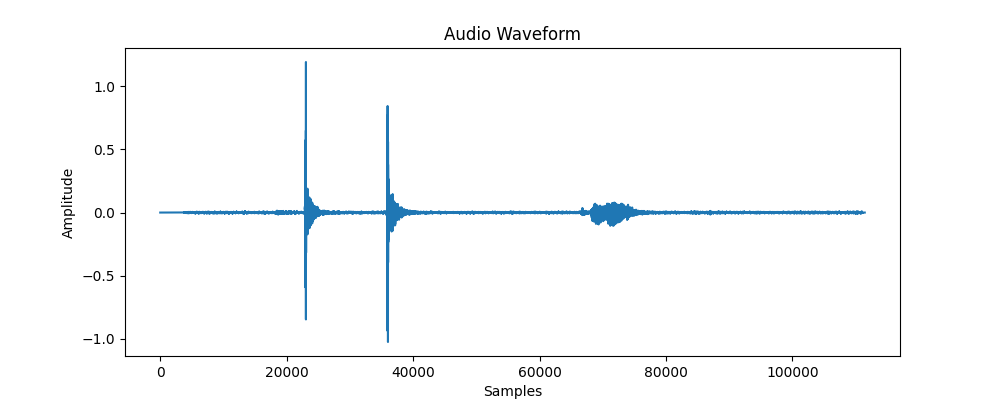
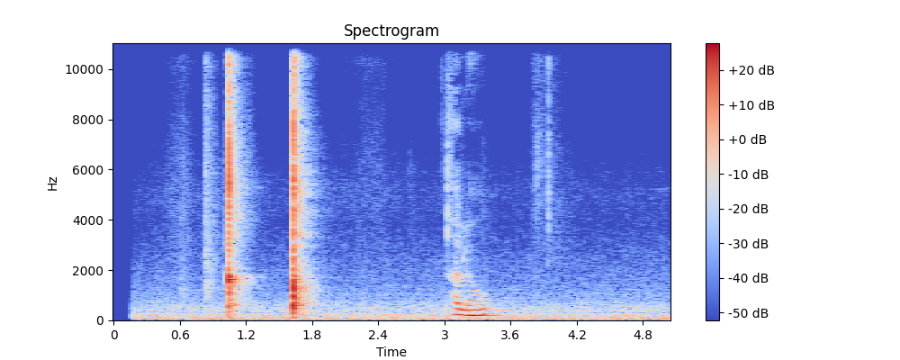

# AcousticML-Classifier

A small Python project that demonstrates **audio signal processing and visualization** using `librosa`.

The system loads an audio file, converts it into a numerical signal, and visualizes:

* the **waveform** (time-domain representation)
* the **spectrogram** (frequency-domain representation)

These are the first steps in most **audio machine learning pipelines**.

---

## Project Structure

```
AcousticML-Classifier
│
├── src
│   ├── load_audio.py
│   └── spectrogram.py
│
├── samples
│   └── test.wav
│
├── outputs
│   ├── waveform.png
│   └── spectrogram.png
│
├── requirements.txt
└── README.md
```

---

## Waveform

The waveform shows **air pressure amplitude over time** captured by the microphone.



---

## Spectrogram

The spectrogram shows **frequency energy over time**.
Brighter colors indicate stronger frequency components.



---

## Installation

Clone the repository.

```
git clone https://github.com/YOUR_USERNAME/AcousticML-Classifier.git
cd AcousticML-Classifier
```

Create a virtual environment.

```
python3 -m venv acousticml-env
source acousticml-env/bin/activate
```

Install dependencies.

```
pip install -r requirements.txt
```

---

## Run

Load and visualize waveform:

```
python src/load_audio.py
```

Generate spectrogram:

```
python src/spectrogram.py
```

---

## Tech Stack

* Python
* Librosa
* NumPy
* Matplotlib
* SoundFile

---

## Next Steps

Future improvements:

* MFCC feature extraction
* Audio classification model
* Dataset integration
* Spectrogram-based deep learning models

